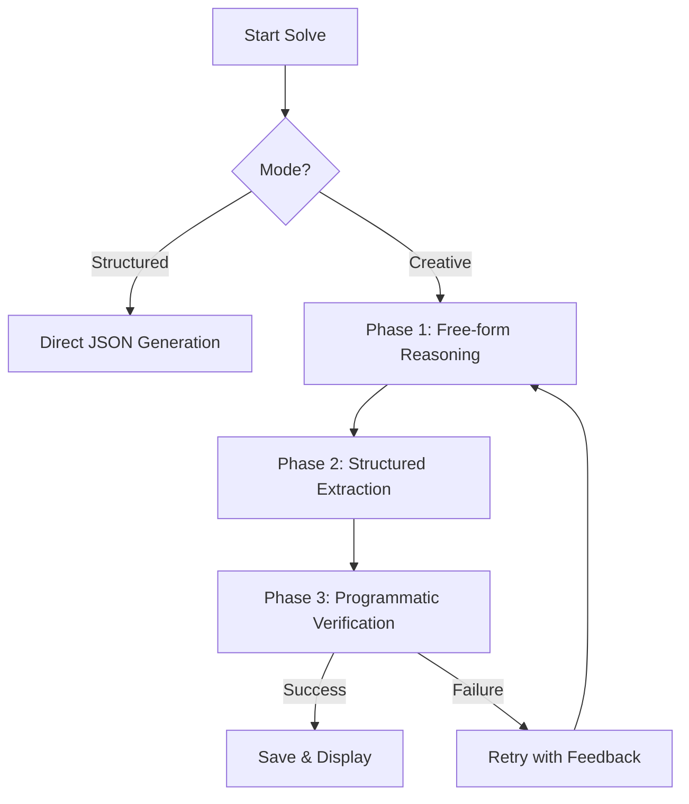

# Ajuda Ai 🎓

Ajuda Ai is an intelligent, discreet test-solving assistant designed to quickly extract and solve exam questions using the power of Google Gemini. It is built with stealth and privacy in mind, allowing users to covertly get answers during tests.

## 📸 Showcase

<p align="center">
  
</p>

## ✨ Features

### 🧠 Pre-Test Preparation (Warm-up)
- **Multi-modal Context:** Upload PDFs, images, audio recordings, or YouTube links before the test begins.
- **AI Contextualization:** Gemini ingests your material to understand the specific subject matter, formulas, and vocabulary required for the exam.
- **Flexible Modes:** Choose between generating a concise summary or providing the full context to the AI for every question during the test.

### 📝 Smart Test Solving
- **Rapid Question Extraction:** Upload photos of your test or paste text directly to get immediate answers.
- **Multiple Solving Modes:**
  - **Structured Mode:** Direct, fast answers for quick retrieval.
  - **Creative Mode:** Deep reasoning with multi-step verification to ensure accuracy on complex questions.
- **Support for All Types:** Handles multiple choice, open-ended writing, mathematical problems, and even requests for diagrams (via ASCII art and image generation).
- **Double Verification:** Every answer is automatically cross-checked by the AI to minimize hallucinations and ensure correctness.

### 🕵️ Stealth & Privacy
- **Stealth Mode (Blackout):** A built-in panic feature. Triple-tap anywhere on the screen to instantly toggle a pure blackout screen, hiding the app's interface immediately.
- **Local Storage:** All your tests, materials, and answers are stored locally in your browser using IndexedDB (Dexie.js). No data is saved on external servers (other than being processed by Google's API).

### 🌍 Accessibility & Customization
- **Multi-language:** Full support for Portuguese and English.
- **Theme Support:** Light and dark modes.
- **Vibration Feedback:** Haptic feedback confirms stealth mode activation without needing to look at the screen.
- **Customizable AI:** Choose between different Gemini models (Pro vs. Flash) to balance speed and accuracy.

## 🚀 Tech Stack
- **Frontend:** React 19, TypeScript, Vite.
- **UI Components:** HeroUI (NextUI), Mantine Hooks, Lucide Icons.
- **AI:** Google Gemini API (@google/genai).
- **Database:** Dexie.js (IndexedDB).
- **Routing:** React Router 7.

## 🔒 Security & Privacy Transparency

**Important:** Your Gemini API key is stored **locally** in your browser's IndexedDB. It is never sent to any server other than Google's official Gemini API endpoints. 
- **Do not** use this app on public or shared computers.
- **Do not** upload sensitive personal information, passwords, or confidential documents in the attachments, as they are processed by Google's AI models.

## 🛠️ Setup & Local Development

### For Users
1. Get a Gemini API Key from [Google AI Studio](https://aistudio.google.com/app/api-keys).
2. Open the app and go to **Settings**.
3. Paste your API Key.
4. Start creating your tests!

### For Developers
To run this project locally:

```bash
# 1. Clone the repository
git clone https://github.com/PanicTitan/ajuda-ai.git
cd ajuda-ai

# 2. Install dependencies
npm install

# 3. Start the development server
npm run dev
```

## 🤖 Gemini Strategy & Resilience

Ajuda Ai implements a sophisticated multi-step strategy to ensure high-quality answers and network resilience, crucial for environments with unstable internet.

### 🔄 Creative Mode Workflow
When using **Creative Mode**, the system performs a multi-pass reasoning process:



### 🛡️ Resilience Features
- **Filter Handling:** Automatically detects `RECITATION` or `SAFETY` blocks and retries with paraphrasing instructions or token injection (`@_@`) to bypass restrictions.
- **Model Downgrade:** If a quota error occurs, the system automatically cycles through models: `Pro -> Flash -> Flash Lite`.
- **Network Recovery:** Requests are queued when offline and automatically resumed with exponential backoff when the connection returns, ensuring no data is lost during intermittent connectivity.
